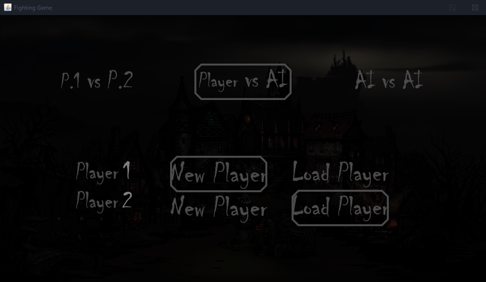
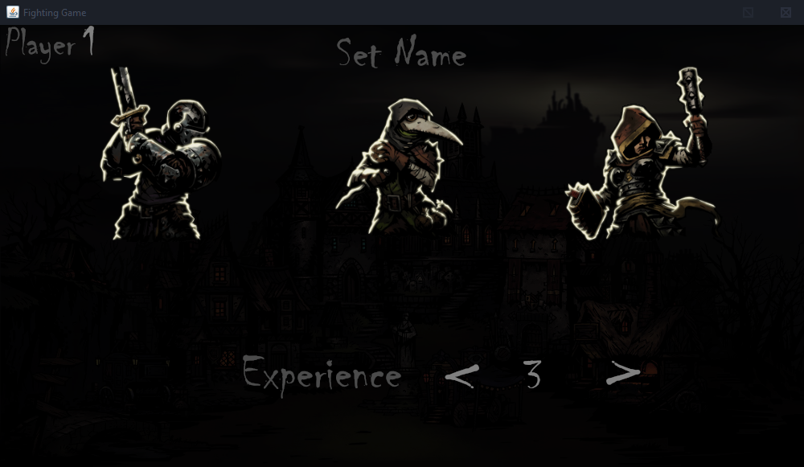
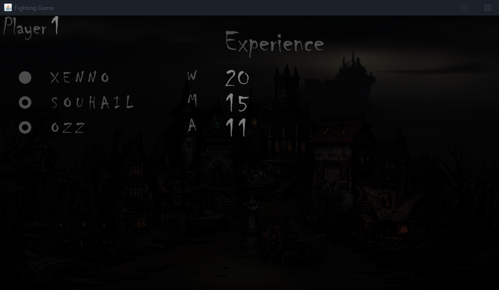
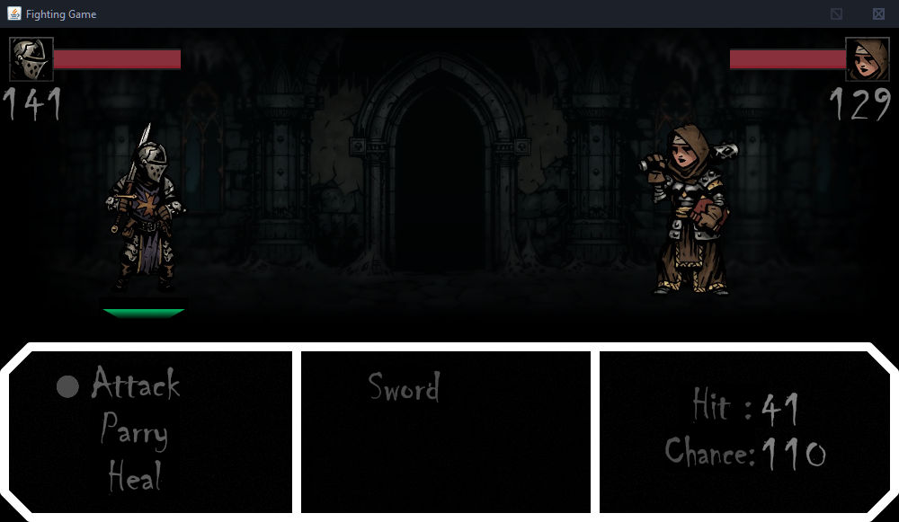
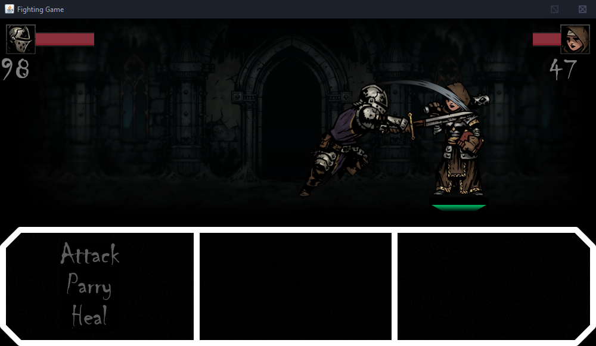
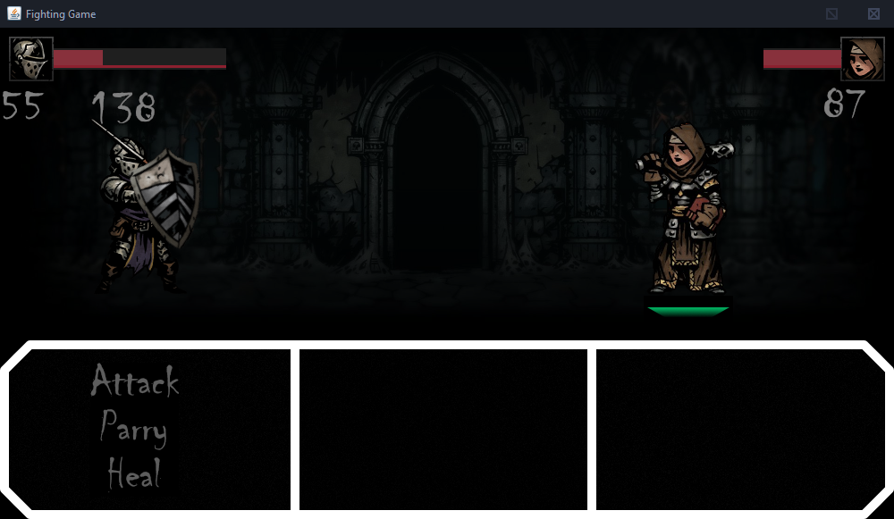

# Game Engine
Built a custom game engine in addition to arenderer, window manager, input manager. and an abstract objects class. 

# The Game
This is a simple turn based role-playing-game, with the option to play player vs player, player vs Computer or just watch a match between two computers. 

The player (or the computer) have the option to choose between 3 in-game classes, and to each there is a set of attributes that are used to calculate the damage or healing done, with the option to level up an attribute if the character has won a duel. 
Each created character is stored in a local database and can be played again any time.

# Gameplay Images 
### Game Mode Selection

### Character Creation

### Character Selection from database

### Screenshot of the Turn Based Combat

